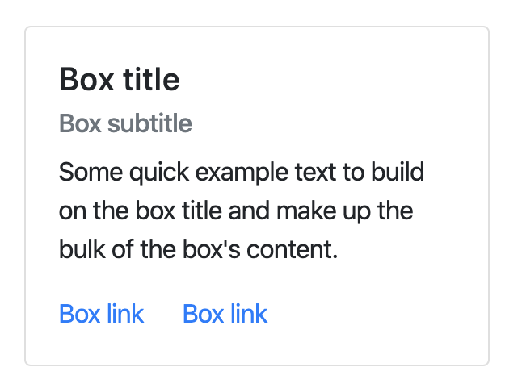
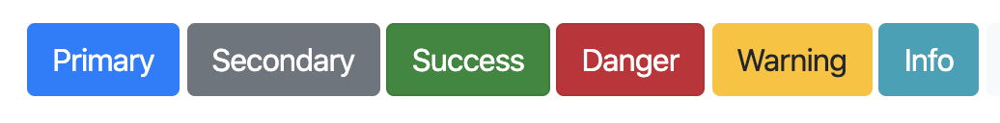

[](https://generalassemb.ly/education/web-development-immersive)


## Save the Seniors of As Salamah, Jeddah, KSA!

COVID-19 is a new illness that can affect your lungs and airways. It's caused by a virus called coronavirus.

The symptoms of coronavirus are:

- a cough
- a high temperature
- shortness of breath

But these symptoms do not necessarily mean you have the illness.

The symptoms are similar to other illnesses that are much more common, such as cold and flu.

Simple measures like washing your hands often with soap and water can help stop viruses like coronavirus (COVID-19) spreading.

There's no specific treatment for coronavirus (COVID-19). Treatment aims to relieve the symptoms until you recover.

It's not known exactly how coronavirus (COVID-19) spreads from person to person, but similar viruses are spread in cough droplets.

### Problem / Prompt

---


A curfew from <strong>06:00Hrs - 19:00Hrs</strong> has been implemented by the <strong>Kingdom of Saudi Arabia</strong> to ensure the safety of the kingdom and cortail the spread of the virus.

<strong>As Salamah District in Jeddah, Saudi Arabia</strong> has a large population of senior citizen who can not go to the store and compete with the younger citizens in panick shopping to stock up on groceries during the curfew.

We need some way to get the list of things needed by the seniors and deliver to a location closer to them for pick up.

The King decided to call on the <strong>SEI-12 team</strong> to develop a web app which allows the seniors create a list of their required `items` and any registered youth can run these errands for them.

#### Task 1:

The `Seniors` should be able to register as a senior with contact details(name, address, age and phone number) and create a list with an expected delivery date. The list should contain items and a status ( _0 - free,1 - inProgress and 2 - fulfilled_), each item should have a name and quantity.

#### Task 2:

The `Helpers` should be able to register as a helper with contact details(name, address, age and phone number). Helper should be able to view all lists which have status of free.

#### Task 3:

Helpers should also be able to view unfulfilled lists. They should also be able to see lists if they are fulfilling the list or have been fulfilled by them on their profile page.

## Help the seniors


### Get Started

```terminal
  $ git clone https://git.generalassemb.ly/sei-jeddah/full_day_practice_challenge.git

  $ cd coronavirus_challenge
  $ npm install
  $ touch .env
```

### Requirements

---

1.  All Users must be registered on the web app to post and accept task.
1.  There should be 3 types of users:
    - Admin
    - Senior
    - Helper
1.  All users should only login with phone number and password.
1.  Anyone should be able to view the Seniors lists
1.  Only `helpers` can accept / deliver grocery items
1.  Items should be stored in seperate collection if needed.

### Hints

---

- User Model can have the following fields as booleans to restrict what is seen by the end user:
  - isAdmin
  - isHelper
  - isSenior
- [Query by in Mongoose](https://mongoosejs.com/docs/api.html#model_Model.find)

- Grid styled CSS:
  I have added system which allows for a maximum of 12 columns, in my example below `col-4` means of size 4 and `4 x 3 = 12`

```html
<div class="container">
  <div class="row">
    <div class="col-4">Left column</div>
    <div class="col-4">Center column</div>
    <div class="col-4">Right column</div>
  </div>
</div>
```


- box

```html
<div class="box" style="width: 18rem;">
  <div class="box-body">
    <h5 class="box-title">Card title</h5>
    <h6 class="box-subtitle mb-2 text-muted">Card subtitle</h6>
    <p class="box-text">
      Some quick example text to build on the card title and make up the bulk of
      the card's content.
    </p>
    <a href="#" class="box-link">Card link</a>
    <a href="#" class="box-link">Another link</a>
  </div>
</div>
```



- Button

```html
<button class="btn btn-primary">Primary</button>
<button class="btn btn-success">Success</button>
<button class="btn btn-danger">Danger</button>
```



- Forms

```html
<form>
  <div class="row">
    <div class="col-6">
      <label for="inputAddress">Email</label>
      <input type="text" class="form-input" placeholder="Email" />
    </div>
    <div class="col-6">
      <label for="inputAddress">Password</label>
      <input type="text" class="form-input" placeholder="Password" />
    </div>
  </div>
  <div class="row">
    <div class="col-12">
      <label for="inputAddress">Address</label>
      <input
        type="text"
        class="form-input"
        id="inputAddress"
        placeholder="1234 Main St"
      />
    </div>
  </div>
</form>
```


### Bonus

---

1. Include JQuery for validation on client side
1. Add some animations, to view full details as a modal popup

 <details>
  <summary>To Chip In </summary>
  
 ### Information for users
 ----
 ```javascript
 {
     firstname: "",
     lastname:"",
     dateOfBirth: "",
     address: {
         houseNumber: 0,
         street: "",
         city : "",
         district: ""
     },
     lists:[]
 }
 ```
### List information
----
  ```javascript
 {
     lists: [
         {
            items:[
                {
                    item: "",
                    quantity: 0
                }
            ],
            deliveryDate:"",
            status: 0 // 0/ 1 / 2
         }
    ]
 }
 ```
</details>

### Credits

---

- [Iweala Ebere](mailto:ebere.iweala@ga.co)

### References

---

- [NHS UK](https://www.nhs.uk/conditions/coronavirus-covid-19/#symptoms)
- [Shutter Stock](https://image.shutterstock.com/image-photo/dubai-united-arab-emirates-circa-260nw-396264253.jpg)
